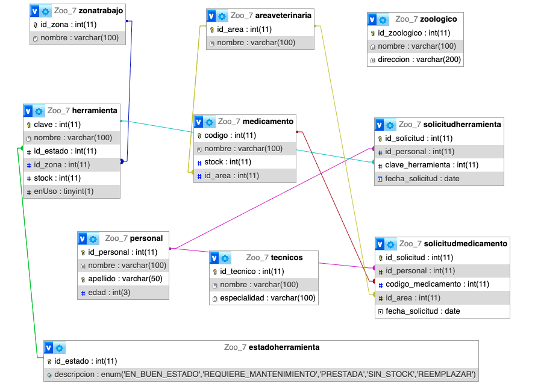

# Zoo Database

Relational database for zoo management, including staff, veterinary areas, medicines, tools, and requests.

## Project Overview
This project models a zoo's internal operations through a relational database.  
It includes tables for staff, tools, medicines, technical staff, work areas, veterinary areas, and their relationships.  

The goal is to provide a structured way to manage:
- Personnel
- Tools and their status
- Medicines and stock levels
- Veterinary areas and work zones
- Requests for tools and medicines

---

## Entity Relationship Diagram (ERD)
The following diagram illustrates the structure of the database and its relationships:

*ERD Screenshot*  

